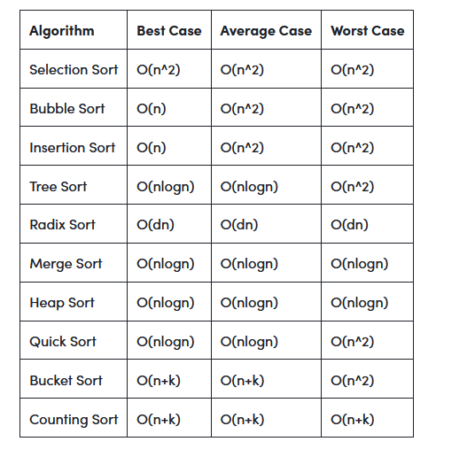
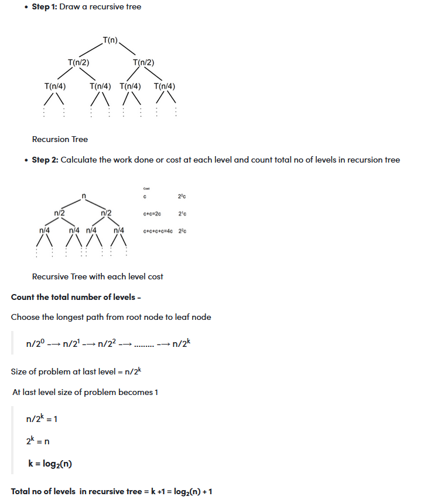
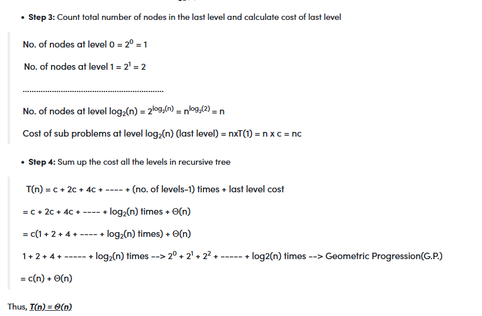

[back](./../contents.md)

In Asymptotic Analysis, we evaluate the performance of an algorithm in terms of input size

    - Best case : In the best case analysis, we calculate lower bound on running time of an algorithm
    - Worst case : In the worst case analysis, we calculate upper bound on running time of an algorithm
    - Average case:  In average case analysis, we take all possible inputs and calculate computing time for all of the inputs. Sum all the calculated values and       divide   the sum by total number of inputs

---

A - Linear Search
B - Binary Search

    Input Size	Running time on A	Running time on B
        10	    2 sec	            ~ 1 h
        100	    20 sec	            ~ 1.8 h
        10^6 	~ 55.5 h	        ~ 5.5 h
        10^9	~ 6.3 years 	    ~ 8.3 h

---

e.g.

    int search(int arr[], int n, int x)
        {
            int i;
            for (i = 0; i < n; i++) {
                if (arr[i] == x)
                return i;
            }
            return -1;
        }

---

- Best Case: O(1)
- Average Case: O(n)
- Worst Case: O(n)

---

    -Most of the times, we do the worst case analysis to analyze algorithms. In the worst analysis, we guarantee an upper bound on the running time of an algorithm which is a good piece of information.
    -The average case analysis is not easy to do in most of the practical cases and it is rarely done. In the average case analysis, we must know (or predict) the mathematical distribution of all possible inputs.
    -The Best Case analysis is bogus. Guaranteeing a lower bound on an algorithm doesn't provide any information as in the worst case, an algorithm may take years to run.

---

---

- Logarithmic algorithm - O(logn) - Binary Search.
- Linear algorithm - O(n) - Linear Search.
- Superlinear algorithm - O(nlogn) - Heap Sort, Merge Sort.
- Polynomial algorithm - O(n^c) - Strassen’s Matrix Multiplication, Bubble Sort, Selection Sort, Insertion Sort, Bucket Sort.
- Exponential algorithm - O(c^n) - Tower of Hanoi.
- Factorial algorithm - O(n!) - Determinant Expansion by Minors, Brute force Search algorithm for Traveling Salesman Problem.

---

Analysis of Common loops

1. O(1): Time complexity of a function (or set of statements) is considered as O(1) if it doesn't contain loop, recursion, and call to any other non-constant time function.

2) O(n): Time Complexity of a loop is considered as O(n) if the loop variables are incremented/decremented by a constant amount. For recursive call in recursive function, the time complexity is considered as O(n).

3) O(n^2): Time complexity of nested loops is equal to the number of times the innermost statement is executed.

4) O(Logn) Time Complexity of a loop is considered as O(Logn) if the loop variables are divided/multiplied by a constant amount.

5) O(LogLogn) Time Complexity of a loop is considered as O(LogLogn) if the loop variables are reduced/increased exponentially by a constant amount.

- When there are consecutive loops, we calculate time complexity as a sum of time complexities of individual loops.
- When there are consecutive loops, we calculate time complexity as a sum of time complexities of individual loops.

---

---

Analysis of Recursion

- recurrence tree: Steps to solve recurrence relation using recursion tree method:

      1. Draw a recursive tree for given recurrence relation
      2. Calculate the cost at each level and count the total no of levels in the recursion tree.
      3. Count the total number of nodes in the last level and calculate the cost of the last level
      4. Sum up the cost of all the levels in the recursive tree

---

Question 1: T(n) = 2T(n/2) + c

---

Space Complexity:

- Auxiliary Space is the extra space or temporary space used by an algorithm.

- Space Complexity of an algorithm is the total space taken by the algorithm with respect to the input size.
