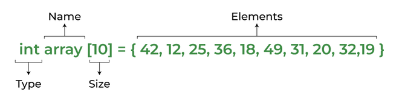

[back](./../readme.md)

# Arrays

## Introduction

An array is a collection of items of the same variable type stored that are stored at contiguous memory locations.

Basic terminologies of array

- Array Index: In an array, elements are identified by their indexes. Array index starts from 0.
- Array element: Elements are items stored in an array and can be accessed by their index.
- Array Length: The length of an array is determined by the number of elements it can contain.

### Declaration:

    int arr[5];	 // This array will store integer type element
    char arr[10]; // This array will store char type element
    float arr[20]; // This array will store float type element

A declaration means allocating memory for an array of a given size.

The above declaration is static or compile-time memory allocation, which means that the array element’s memory is allocated when a program is compiled.

**The idea of an array is to represent many instances in one variable..**

## Implementing Arrays in C++ using STL

Arrays can also be implemented using some built-in classes available in the C++ Standard Template Library.

- Vector
- List

### Vector

- Vectors are same as dynamic arrays with the ability to resize itself automatically when an element is inserted or deleted, with their storage being handled automatically by the container.
- Vector elements are placed in contiguous storage so that they can be accessed and traversed using iterators.
- In vectors, data is inserted at the end. Inserting at the end takes differential time, as sometimes there may be a need of extending the array.- Removing the last element takes only constant time because no resizing happens.

- Inserting and erasing at the beginning or in the middle is linear in time.

        #include< vector >

Declaring Vector:

    vector< Type_of_element > vector_name;

Here, Type_of_element can be any valid C++ data type,
or can be any other container also like Pair, List etc.

Commonly used functions of Vector class are:

- **begin()** – Returns an iterator pointing to the first element in the vector.
- **end()** – Returns an iterator pointing to the theoretical element that follows the last element in the vector.
- **size()** – Returns the number of elements in the vector.
- **capacity()** – Returns the size of the storage space currently allocated to the vector expressed as number of elements.
- **empty()** – Returns whether the container is empty.
- **push_back()** – It push the elements into a vector from the back.
- **pop_back()** – It is used to pop or remove elements from a vector from the back.
- **insert()** – It inserts new elements before the element at the specified position.
- **erase()** – It is used to remove elements from a container from the specified position or range.
- **swap()** – It is used to swap the contents of one vector with another vector of same type and size.
- **clear()** – It is used to remove all the elements of the vector container.
- **emplace()** – It extends the container by inserting new element at position.
- **emplace_back()** – It is used to insert a new element into the vector container, the new element is added to the end of the vector.

C++ program to illustrate the above functions

    #include <iostream>
    #include <vector>

    using namespace std;

    int main()
    {
        vector<int> v;

        // Push elements
        for (int i = 1; i <= 5; i++)
            v.push_back(i);

        cout << "Size : " << v.size();

        // checks if the vector is empty or not
        if (v.empty() == false)
            cout << "\nVector is not empty";
        else
            cout << "\nVector is empty";

        cout << "\nOutput of begin and end: ";
        for (auto i = v.begin(); i != v.end(); ++i)
            cout << *i << " ";

        // inserts at the beginning
        v.emplace(v.begin(), 5);
        cout << "\nThe first element is: " << v[0];

        // Inserts 20 at the end
        v.emplace_back(20);
        int n = v.size();
        cout << "\nThe last element is: " << v[n - 1];

        // erases the vector
        v.clear();
        cout << "\nVector size after erase(): " << v.size();

        return 0;
    }

## Types of Array operations:

- Traversal: Traverse through the elements of an array.
- Insertion: Inserting a new element in an array.
- Deletion: Deleting element from the array.
- Searching: Search for an element in the array.
- Sorting: Maintaining the order of elements in the array.

[next](./sampleProblemsArray.md)
