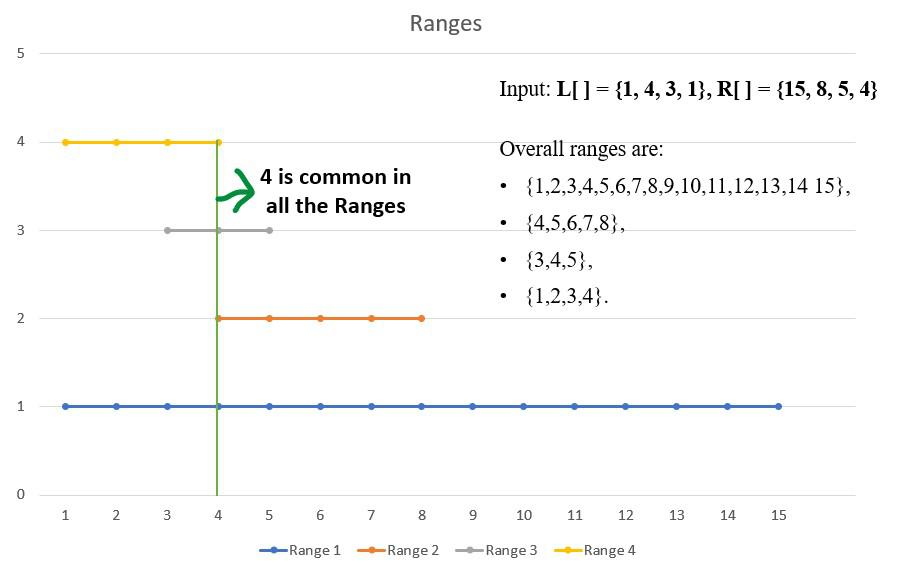

[home](../../readme.md) || [back](./majorityElement.md)

# Maximum Appearing Element

Given two arrays L[ ] and R[ ] of size N where L[i] and R[i] (0 ≤ L[i], R[i] < 106) denotes a range of numbers, the task is to find the maximum occurred integer in all the ranges. If more than one such integer exists, print the smallest one.

Examples:

    Input: L[ ] = {1, 4, 3, 1}, R[ ] = {15, 8, 5, 4}
    Output: 4

    Explanation: Overall ranges are: {1,2,3,4,5,6,7,8,9,10,11,12,13,14 15}, {4,5,6,7,8}, {3,4,5}, {1,2,3,4}.

    In all these ranges, 4 appears the most times.

Solution:

Follow the below steps to Implement the idea:

- Initialize a Hash array arr[] to store the occurrence of every element in all the ranges combined.
- Iterate over all the N ranges and increment L[i] by one and decrement R[i] by one.
- Run a Loop from 1 to the maximum end value of all the ranges and take the Prefix sum.

The idea is to use the Difference array technique. Create a vector initialized with value zero. Iterate through every range and mark the presence of the beginning of every range by incrementing the start of the range with one i.e. arr[L[i]]++ and mark the end of the range by decrementing at index one greater than the end of range by one i.e. arr[R[i]+1]–.

Now when computing the prefix sum, Since the beginning is marked with one, all the values after beginning will be incremented by one. Now as increment is only targeted only till the end of the range, the decrement on index R[i]+1 prevents that for every range i.

    // Return the maximum occurred element in all ranges.
    int maximumOccurredElement(int L[], int R[], int n)
    {
        // Initialising all element of array to 0.
        int arr[MAX];
        memset(arr, 0, sizeof arr);

        // Adding +1 at Li index and subtracting 1
        // at Ri index.
        int maxi = -1;
        for (int i = 0; i < n; i++) {
            arr[L[i]] += 1;
            arr[R[i] + 1] -= 1;
            if (R[i] > maxi) {
                maxi = R[i];
            }
        }

        // Finding prefix sum and index having maximum
        // prefix sum.
        int msum = arr[0], ind;
        for (int i = 1; i < maxi + 1; i++) {
            arr[i] += arr[i - 1];
            if (msum < arr[i]) {
                msum = arr[i];
                ind = i;
            }
        }

        return ind;
    }

Representation:

- int L[] = { 4,1, 3, 1};
- int R[] = { 5,8, 5, 4};

        R[0] : 5 ,L[0] : 4

        0 0 0 0 1

        R[1] : 8 ,L[1] : 1

        0 1 0 0 1 0 -1 0

        R[2] : 5 ,L[2] : 3

        0 1 0 1 1 0 -2 0

        R[3] : 4 ,L[3] : 1

        0 2 0 1 1 -1 -2 0

        0 2 0 1 1 -1 -2 0

        0 2 2 1 1 -1 -2 0

        0 2 2 3 1 -1 -2 0

        0 2 2 3 4 -1 -2 0

        0 2 2 3 4 3 -2 0

        0 2 2 3 4 3 1 0

        0 2 2 3 4 3 1 1

        0 2 2 3 4 3 1 1

        Answer 4

[next](../techniques.md)
