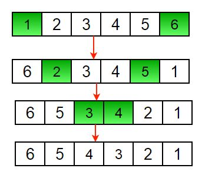

[home](./../readme.md) || [back](./sampleProblemsArray.md)

5.  Largest Element in an Array

    Given an array arr of size N, the task is to find the largest element in the given array.

    Example:

         Input: arr[] = {10, 20, 4}
         Output: 20

         Input : arr[] = {20, 10, 20, 4, 100}
         Output : 100

    - One of the most simplest and basic approach to solve this problem is to simply traverse the whole list and find the maximum among them.

    - Create a local variable max to store the maximum among the list
    - Initialize max with the first element initially, to start the comparison.
    - Then traverse the given array from second element till end, and for each element:
      - Compare the current element with max
      - If the current element is greater than max, then replace the value of max with the current element.
    - At the end, return and print the value of the largest element of array stored in max.

            int largest(int arr[], int n)
            {
                int i;

                // Initialize maximum element
                int max = arr[0];

                // Traverse array elements
                // from second and compare
                // every element with current max
                for (i = 1; i < n; i++)
                    if (arr[i] > max)
                        max = arr[i];

                return max;
            }

6.  Second Largest Element in Array:

    Given an array of integers, our task is to write a program that efficiently finds the second largest element present in the array.

    Example:

        Input: arr[] = {12, 35, 1, 10, 34, 1}
        Output: The second largest element is 34.
        Explanation: The largest element of the
        array is 35 and the second
        largest element is 34

    - Initialize the first as 0 i.e, index of arr[0] element
    - Start traversing the array from array[1],
      - If the current element in array say arr[i] is greater
        than first. Then update first and second as,
        - second = first
        - first = arr[i]
      - If the current element is in between first and second,
        then update second to store the value of current variable as
        second = arr[i]
    - Return the value stored in second.

    Code:

            int secondLargest(int arr[], int n) {
                int first = 0, second = -1;
                for (int i = 1; i < n; i++) {
                    if (arr[i] > arr[first]) {
                        second = first;
                        first = i;
                    }
                    else if (arr[i] < arr[first]) {
                        if (second == -1 || arr[second] < arr[i])
                            second = i;
                    }
                }
                return second;
            }

7.  Check if an Array is Sorted

    Given an array of size n, write a program to check if it is sorted in ascending order or not.

    Equal values are allowed in an array and two consecutive equal values are considered sorted.

        bool arraySortedOrNot(int arr[], int n)
        {
            // Array has one or no element
            if (n == 0 || n == 1)
                return true;

            for (int i = 1; i < n; i++)

                // Unsorted pair found
                if (arr[i - 1] > arr[i])
                    return false;

            // No unsorted pair found
            return true;
        }

8.  Reverse an Array:

    Given an array (or string), the task is to reverse the array/string.

    Examples :

        Input  : arr[] = {1, 2, 3}
        Output : arr[] = {3, 2, 1}

        Input :  arr[] = {4, 5, 1, 2}
        Output : arr[] = {2, 1, 5, 4}

    - Initialize start and end indexes as start = 0, end = n-1
    - In a loop, swap arr[start] with arr[end] and change start and end as follows :
      - start = start +1, end = end – 1

    

    Code:

        void rvereseArray(int arr[], int start, int end)
        {
            while (start < end)
            {
                int temp = arr[start];
                arr[start] = arr[end];
                arr[end] = temp;
                start++;
                end--;
            }
        }

9.  Remove duplicates from a sorted array:

    Given a sorted array, the task is to remove the duplicate elements from the array.

    Examples:

        Input  : arr[] = {2, 2, 2, 2, 2}
        Output : arr[] = {2}
                new size = 1

        Input  : arr[] = {1, 2, 2, 3, 4, 4, 4, 5, 5}
        Output : arr[] = {1, 2, 3, 4, 5}
                new size = 5

Code:

    int remDups(int arr[], int n)
    {
        int res = 1;

        for(int i = 1; i < n; i++)
        {
            if(arr[res - 1] != arr[i])
            {
                arr[res] = arr[i];
                res++;
            }
        }

        return res;
    }

Example:

    res = 1 i = 0
        10 20 20 30 30 30

    res = 2 i = 1
        10 20 20 30 30 30

    res = 2 i = 2
        10 20 30 30 30 30

    res = 3 i = 3
        10 20 30 30 30 30

    res = 3 i = 4
        10 20 30 30 30 30

    res = 3 i = 5

10. Move Zeros to End:

    Given an array of n numbers. The problem is to move all the 0’s to the end of the array while maintaining the order of the other elements. Only single traversal of the array is required.

    Examples:

        Input : arr[]  = {1, 2, 0, 0, 0, 3, 6}
        Output : 1 2 3 6 0 0 0

        Input: arr[] = {0, 1, 9, 8, 4, 0, 0, 2, 7, 0, 6, 0, 9}
        Output: 1 9 8 4 2 7 6 9 0 0 0 0 0

    Psuedo-code:

        moveZerosToEnd(arr, n)
        Initialize count = 0
        for i = 0 to n-1
            if (arr[i] != 0) then
                arr[count++]=arr[i]
        for i = count to n-1
            arr[i] = 0

    Representaion:

        Loop1:

            count: 0 i: 0

            0 1 0 0 5 0 3

            count: 0 i: 1

            0 1 0 0 5 0 3

            count: 1 i: 2

            1 1 0 0 5 0 3

            count: 1 i: 3

            1 1 0 0 5 0 3

            count: 1 i: 4

            1 1 0 0 5 0 3

            count: 2 i: 5

            1 5 0 0 5 0 3

            count: 2 i: 6

        Loop 2:

            1 5 0 0 5 0 3

            1 5 3 0 5 0 3

            1 5 3 0 0 0 3

            1 5 3 0 0 0 3

            1 5 3 0 0 0 0

HomeWork: Write a program in your preferred language for the above psuedo code.

[next](./rotateArrByD.md)
