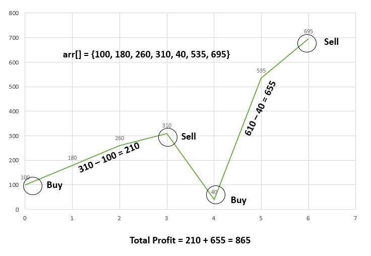

[home](./../readme.md) || [back](./frequencyArray.md)

# Stock Buy and Sell Problem

The cost of a stock on each day is given in an array. Find the maximum profit that you can make by buying and selling on those days.

If the given array of prices is sorted in decreasing order, then profit cannot be earned at all.

]

Examples:

    Input: arr[] = {100, 180, 260, 310, 40, 535, 695}
    Output: 865
    Explanation:
    Buy the stock on day 0 and sell it on day 3 => 310 – 100 = 210. Buy the stock on day 4 and sell it on day 6 => 695 – 40 = 655.
    Maximum Profit  = 210 + 655 = 865

Find the next greater element and subtract it from the current element so that the difference keeps increasing until we reach a minimum.

If the sequence is a decreasing sequence, so the maximum profit possible is 0.

Follow the steps below to solve the problem:

    maxProfit = 0
    if price[i] > price[i – 1]
         maxProfit = maxProfit + price[i] – price[i – 1]

Code:

    int maxProfit(int price[], int n)
    {
        int profit = 0;

        for(int i = 1; i < n; i++)
        {
            if(price[i] > price[i - 1])
                profit += price[i] - price[i -1];
        }

        return profit;

    }

Representation:

    profit : 0, i: 0, i-1: -1, price[i]: 100

    profit : 80, i: 1, i-1: 0, price[i]: 180, price[i-1]: 100

    profit : 160, i: 2, i-1: 1, price[i]: 260, price[i-1]: 180

    profit : 210, i: 3, i-1: 2, price[i]: 310, price[i-1]: 260

    profit : 210, i: 4, i-1: 3, price[i]: 40, price[i-1]: 310

    profit : 705, i: 5, i-1: 4, price[i]: 535, price[i-1]: 40

    profit : 865, i: 6, i-1: 5, price[i]: 695, price[i-1]: 535

    profit : 865
