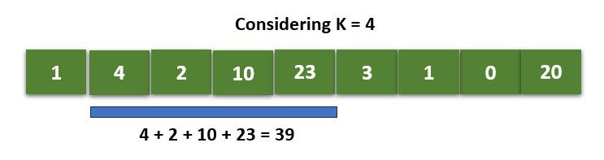

[home](./../readme.md) || [back](./problems//maximumAppElement.md)

## 1. Sliding Window Technique

Given an array of integers of size 'n'. Our aim is to calculate the maximum sum of 'k' consecutive elements in the array.

Examples:

    Input  : arr[] = {1, 4, 2, 10, 23, 3, 1, 0, 20}
            k = 4
    Output : 39
    We get maximum sum by adding subarray {4, 2, 10, 23}
    of size 4.

The Naive Approach to solve this problem is to calculate sum for each of the blocks of K consecutive elements and compare which block has the maximum sum possible.

**Homework**: Code the naive approach yourself.

#### Efficient Approach (Window Sliding Technique):

The above problem can be solved in Linear Time Complexity by using **Window Sliding Technique** by avoiding the overhead of calculating sum repeatedly for each block of k elements.

- The technique can be best understood with the window pane in bus,
- Consider a window of length n and the pane which is fixed in it of length k.
- Consider, initially the pane is at extreme left i.e., at 0 units from the left.
- Now, if we apply force on the window such that it moves a unit distance ahead. The pane will cover next k consecutive elements.
- Now, co-relate the window with array arr[] of size n and plane with current_sum of size k elements.

Consider an array arr[] = {5 , 2 , -1 , 0 , 3} and value of k = 3 and n = 5

Applying sliding window technique :

- We compute the sum of first k elements out of n terms using a linear loop and store the sum in variable window_sum.
- Then we will graze linearly over the array till it reaches the end and simultaneously keep track of maximum sum.
- To get the current sum of block of k elements just subtract the first element from the previous block and add the last element of the current block .

        // Returns maximum sum in a subarray of size k.
        int maxSum(int arr[], int n, int k)
        {
            // n must be greater
            if (n < k) {
                cout << "Invalid";
                return -1;
            }

            // sum of first window of size k
            int window_sum = 0;
            for (int i = 0; i < k; i++)
                window_sum += arr[i];

            // Compute sums of remaining windows by
            // removing first element of previous
            // window and adding last element of
            // current window.
            int max_sum = window_sum;
            for (int i = k; i < n; i++) {
                window_sum += (arr[i] - arr[i - k]);
                max_sum = max(max_sum, window_sum);
            }
            return max_sum;
        }

## 2. Prefix Sum Technique

Given an array arr[] of size n, its prefix sum array is another array prefixSum[] of the same size, such that the value of

    prefixSum[i] is arr[0] + arr[1] + arr[2] … arr[i].

Examples :

    Input  : arr[] = {10, 20, 10, 5, 15}
    Output : prefixSum[] = {10, 30, 40, 45, 60}
    Explanation : While traversing the array, update the element by adding it with its previous element.
    prefixSum[0] = 10,
    prefixSum[1] = prefixSum[0] + arr[1] = 30,
    prefixSum[2] = prefixSum[1] + arr[2] = 40 and so on.

To fill the prefix sum array, we run through index 1 to last and keep on adding the present element with the previous value in the prefix sum array.

    void fillPrefix( int arr[], int preArray[], int n ) {
        preArray[0] = arr[0];

        for( int i = 1; i < n; i++ ) {
            preArray[i] = preArray[ i - 1 ] + arr[i];
        }
    }
