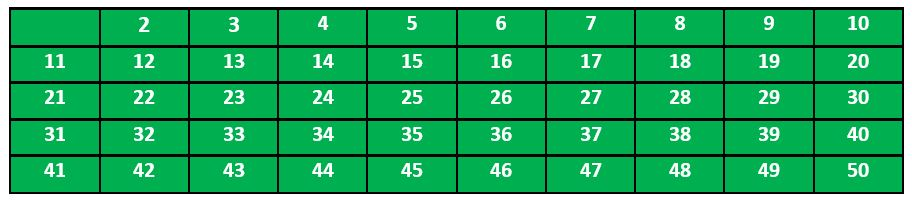
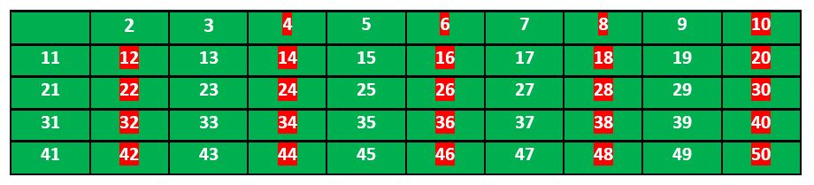
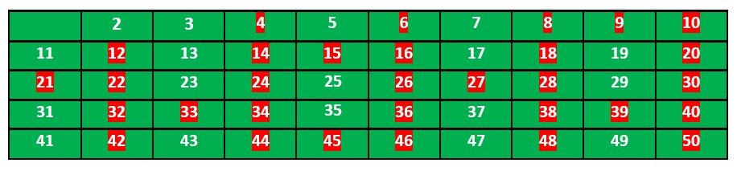
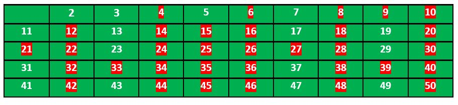
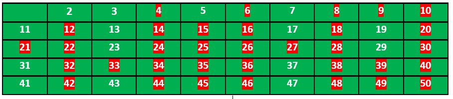

[back](./../readme.md)

1.  Count Digits:

        - Given a number N, the task is to return the count of digits in this number.

            int countDigit(long long n)
            {
                if (n == 0)
                    return 1;
                int count = 0;
                while (n != 0) {
                    n = n / 10;
                    ++count;
                }
                return count;
            }

    The integer entered by the user is stored in the variable n. Then the while loop is iterated until the test expression n != 0 is evaluated to 0 (false). We will consider 3456 as the input integer.

        1. After the first iteration, the value of n will be updated to 345 and the count is incremented to 1.
        2. After the second iteration, the value of n will be updated to 34 and the count is incremented to 2.
        3. After the third iteration, the value of n will be updated to 3 and the count is incremented to 3.
        4. In the fourth iteration, the value of n will be updated to zero and the count will be incremented to 4.
        5. Then the test expression is evaluated ( n!=0 ) as false and the loop terminates with final count as 4.

2.  Palindrome Numbers:

        - Given an integer, write a function that returns true if the given number is palindrome, else false. For example, 12321 is palindrome, but 1451 is not palindrome.

            function checkPalindrome(n)
            {
                let reverse = 0;
                let temp = n;
                while (temp != 0) {
                    reverse = (reverse * 10) + (temp % 10);
                    temp = Math.floor(temp / 10);
                }
                return (reverse == n); // if it is true then it will return 1;
                            // else if false it will return 0;
            }

    To check whether the given number is palindrome or not we will just reverse the digits of the given number and check if the reverse of that number is equal to the original number or not . If reverse of number is equal to that number than the number will be Palindrome else it will not a Palindrome.

3.  Factorial of a Number:

        - Factorial of a non-negative integer is the multiplication of all positive integers smaller than or equal to n. For example factorial of 6 is 6*5*4*3*2*1 which is 720.

            unsigned int factorial(unsigned int n)
            {
                if (n == 0 || n == 1)
                    return 1;
                return n * factorial(n - 1);
            }

    a factorial program using recursive functions. Until the value is not equal to zero, the recursive function will call itself. Factorial can be calculated using the following recursive formula.

        n! = n \* (n – 1)!

        n == 1 if n = 0 or n = 1

    - Iterative approach

            unsigned int factorial(unsigned int n)
            {
                int res = 1, i;
                for (i = 2; i <= n; i++)
                    res *= i;
                return res;
            }

3.1 Trailing Zeros in Factorial:

        - We are given a number. The task is to find the Number of Trailing Zeros in the factorial of the number.

            The Trailing Zeros are the Zeros, which appear at the end of a number(factorial in that case)
            e.g.:
            Input: 5
            Output: 1
            // Factorial of 5 = 5*4*3*2*1 = 120, which has one trailing 0.

    - Trailing 0s in n! = Count of 5s in prime factors of n! = floor(n/5) + floor(n/25) + floor(n/125) + ....

                int findTrailingZeros(int n)
                {
                    if (n < 0) // Negative Number Edge Case
                        return -1;

                    // Initialize result
                    int count = 0;

                    // Keep dividing n by powers of
                    // 5 and update count
                    for (int i = 5; n / i >= 1; i *= 5)
                        count += n / i;

                    return count;
                }

4.  GCD or HCF of two Numbers:

        - GCD (Greatest Common Divisor) or HCF (Highest Common Factor) of two numbers is the largest number that divides both of them.
        - A simple and old  approach is the Euclidean algorithm by subtraction

        -It is a process of repeat subtraction, carrying the result forward each time until the result is equal to any one number being subtracted. If the answer is greater than 1, there is a GCD (besides 1). If the answer is 1, there is no common divisor (besides 1), and so both numbers are coprime

        -pseudo code for the above approach:

            def gcd(a, b):
                if a == b:
                    return a
                if a > b:
                    gcd(a – b, b)
                else:
                    gcd(a, b – a)
        - For Example  suppose a=98 & b=56

            1. a>b so put a= a-b and b remains same.
            2. So  a=98-56=42  & b= 56 .
                2.1. Since b>a, we check if b%a==0. since answer is no we proceed further.
                2.2. Now b>a  so  b=b-a and a remain same.
            3. So b= 56-42 = 14 & a= 42   .
                    3.1.Since a>b, we check if a%b==0 . Now the answer is yes.
                    3.2. So we print smaller among a and b as H.C.F .
            4. i.e. 42 is  3 times of 14
            so HCF is 14.

            Code:

                int gcd(int a, int b)
                {
                    // Everything divides 0
                    if (a == 0)
                    return b;
                    if (b == 0)
                    return a;

                    // base case
                    if (a == b)
                        return a;

                    // a is greater
                    if (a > b)
                        return gcd(a-b, b);
                    return gcd(a, b-a);
                }

    - Efficient Approach:

      We don’t perform subtraction here. we continuously divide the bigger number by the smaller number.

            int gcd(int a, int b)
            {
                return b == 0 ? a : gcd(b, a % b);
            }

5.  LCM of Two Numbers:

        - LCM (Least Common Multiple) of two numbers is the smallest number which can be divided by both numbers.
        - An efficient solution is based on the below formula for LCM of two numbers ‘a’ and ‘b’.

                a x b = LCM(a, b) * GCD (a, b)

                LCM(a, b) = (a x b) / GCD(a, b)

                Code:

                    long long gcd(long long int a, long long int b)
                    {
                    if (b == 0)
                        return a;
                    return gcd(b, a % b);
                    }

                    // Function to return LCM of two numbers
                    long long lcm(int a, int b)
                    {
                        return (a*b / gcd(a, b)) ;
                    }

6.  Check for Prime:

        - A prime number is a natural number greater than 1, which is only divisible by 1 and itself. First few prime numbers are: 2 3 5 7 11 13 17 19 23….

    - Interesting facts about Prime numbers:

            1. Except for 2, which is the smallest prime number and the only even prime number, all prime numbers are odd numbers.
            2. Every prime number can be represented in form of 6n + 1 or 6n – 1 except the prime numbers 2 and 3, where n is a natural number.
            3. 2 and 3 are only two consecutive natural numbers that are prime.
            4. Goldbach Conjecture: Every even integer greater than 2 can be expressed as the sum of two primes.
            5. Wilson Theorem: Wilson’s theorem states that a natural number p > 1 is a prime number if and only if

                    (p - 1) ! ≡  -1   mod p
                    OR  (p - 1) ! ≡  (p-1) mod p

            6. Fermat’s Little Theorem: If n is a prime number, then for every a, 1 <= a < n,

                    an-1 ≡ 1 (mod n)
                        OR
                    an-1 % n = 1

            7. Prime Number Theorem: The probability that a given, randomly chosen number n is prime is inversely proportional to its number of digits, or to the logarithm of n.

            8. Lemoine’s Conjecture: Any odd integer greater than 5 can be expressed as a sum of an odd prime (all primes other than 2 are odd) and an even semiprime. A semiprime number is a product of two prime numbers. This is called Lemoine’s conjecture.

- Prime numbers and co-prime numbers:

It is important to distinguish between prime numbers and co-prime numbers. Listed below are the differences between prime and co-prime numbers.

    1. A coprime number is always considered as a pair, whereas a prime number is considered as a single number.
    2. Co-prime numbers are numbers that have no common factor except 1. In contrast, prime numbers do not have such a condition.
    3. A co-prime number can be either prime or composite, but its greatest common factor (GCF) must always be 1. Unlike composite numbers, prime numbers have only two factors, 1 and the number itself.

        Example of co-prime: 13 and 15 are co-primes. The factors of 13 are 1 and 13 and the factors of 15 are 1, 3 and 5. We can see that they have only 1 as their common factor, therefore, they are coprime numbers.

        Example of prime: A few examples of prime numbers are 2, 3, 5, 7 and 11 etc.

HomeWork 1: Write a program to check if 2 numbers are co-prime or not.

    - Check whether a number is Prime or not?

        1. Approach 1: A solution is to iterate through all numbers from 2 to sqrt(n) and for every number check if it divides n.

                bool isPrime(int n)
                {
                    // Corner case
                    if (n <= 1)
                        return false;

                    // Check from 2 to square root of n
                    for (int i = 2; i <= sqrt(n); i++)
                        if (n % i == 0)
                            return false;

                    return true;
                }

        2. Approach 2:
            - In the previous approach given if the size of the given number is too large then its square root will be also very large.
            - So to deal with large size input we will :
                - deal with a few numbers such as 1, 2, 3, and the numbers which are divisible by 2 and 3 in separate cases
                - for remaining numbers, we will iterate our loop from 5 to sqrt(n) and check for each iteration whether that  (iteration) or (that iteration + 2) divides n or not.
            - If we find any number that divides, we return false.

                    bool isPrime(int n)
                    {
                        // Check if n=1 or n=0
                        if (n <= 1)
                            return false;
                        // Check if n=2 or n=3
                        if (n == 2 || n == 3)
                            return true;
                        // Check whether n is divisible by 2 or 3
                        if (n % 2 == 0 || n % 3 == 0)
                            return false;
                        // Check from 5 to square root of n
                        // Iterate i by (i+6)
                        for (int i = 5; i <= sqrt(n); i = i + 6)
                            if (n % i == 0 || n % (i + 2) == 0)
                                return false;

                        return true;
                    }

7.  Prime Factors:

    Prime factor is the factor of the given number which is a prime number. Factors are the numbers you multiply together to get another number. In simple words, prime
    factor is finding which prime numbers multiply together to make the original number.

         Example: The prime factors of 15 are 3 and 5 (because 3×5=15, and 3 and 5 are prime numbers).

    Some interesting fact about Prime Factor :

    - There is only one (unique!) set of prime factors for any number.
    - In order to maintain this property of unique prime factorizations, it is necessary that the number one, 1, be categorized as neither prime nor composite.
    - Prime factorizations can help us with divisibility, simplifying fractions, and finding common denominators for fractions.
    - Pollard’s Rho is a prime factorization algorithm, particularly fast for a large composite number with small prime factors.
    - Prime Factorization is very important to people who try to make (or break) secret codes based on numbers.

    1.  Approach 1:

        Following are the steps to find all prime factors:

            - While n is divisible by 2, print 2 and divide n by 2.
            - After step 1, n must be odd. Now start a loop from i = 3 to square root of n. While i divides n, print i and divide n by i, increment i by 2 and continue.
            - If n is a prime number and is greater than 2, then n will not become 1 by above two steps. So print n if it is greater than 2.

                void primeFactors(int n)
                {
                    // Print the number of 2s that divide n
                    while (n%2 == 0)
                    {
                        printf("%d ", 2);
                        n = n/2;
                    }

                    // n must be odd at this point. So we can skip
                    // one element (Note i = i +2)
                    for (int i = 3; i <= sqrt(n); i = i+2)
                    {
                        // While i divides n, print i and divide n
                        while (n%i == 0)
                        {
                            printf("%d ", i);
                            n = n/i;
                        }
                    }

                    // This condition is to handle the case when n
                    // is a prime number greater than 2
                    if (n > 2)
                        printf ("%d ", n);
                }

    2.  Approach 2:

                    void printPrimeFactors(int n)
                    {
                        if(n <= 1)
                            return;

                        while(n % 2 == 0)
                        {
                            cout<<2<<" ";

                            n = n / 2;
                        }

                        while(n % 3 == 0)
                        {
                            cout<<3<<" ";

                            n = n / 3;
                        }

                        for(int i=5; i*i<=n; i=i+6)
                        {
                            while(n % i == 0)
                            {
                                cout<<i<<" ";

                                n = n / i;
                            }

                            while(n % (i + 2) == 0)
                            {
                                cout<<(i + 2)<<" ";

                                n = n / (i + 2);
                            }
                        }

                        if(n > 3)
                            cout<<n<<" ";

                        cout<<endl;
                    }

8.  All Divisors of a Number:

    Given a natural number n, print all distinct divisors of it.
    Examples:

        Input : n = 10
        Output: 1 2 5 10

        Input:  n = 100
        Output: 1 2 4 5 10 20 25 50 100

        Input:  n = 125
        Output: 1 5 25 125

    - Approach 1:

      Iterate all the numbers from 1 to n, checking if that number divides n and printing it. Below is a program for the same:

            void printDivisors(int n)
            {
                for (int i = 1; i <= n; i++)
                    if (n % i == 0)
                        cout <<" " << i;
            }

    - Approach 2:

      If we look carefully, all the divisors are present in pairs. For example if n = 100, then the various pairs of divisors are: (1,100), (2,50), (4,25), (5,20), (10,10)

      Using this fact we could speed up our program significantly.

      We, however, have to be careful if there are two equal divisors as in the case of (10, 10). In such case, we’d print only one of them.

            void printDivisors(int n)
            {
                // Note that this loop runs till square root
                for (int i=1; i<=sqrt(n); i++)
                {
                    if (n%i == 0)
                    {
                        // If divisors are equal, print only one
                        if (n/i == i)
                            cout <<" "<< i;

                        else // Otherwise print both
                            cout << " "<< i << " " << n/i;
                    }
                }
            }

Homework 2 : Print the divisors in sorted order.

            void printDivisors(int n)
            {
                int i;
                for (i = 1; i * i < n; i++) {
                    if (n % i == 0)
                        cout<<i<<" ";
                }
                if (i - (n / i) == 1) {
                    i--;
                }
                for (; i >= 1; i--) {
                    if (n % i == 0)
                        cout<<n / i<<" ";
                }
            }

9.  Sieve of Eratosthenes:

    Given a number n, print all primes smaller than or equal to n. It is also given that n is a small number.
    Example:

                 Input : n =10
                 Output : 2 3 5 7

                 Input : n = 20
                 Output: 2 3 5 7 11 13 17 19

    Algorithm:

    - Let us take an example when n = 50. So we need to print all prime numbers smaller than or equal to 50.

    1. We create a list of all numbers from 2 to 50.

       

    2. According to the algorithm we will mark all the numbers which are divisible by 2 and are greater than or equal to the square of it.

       

    3. Now we move to our next unmarked number 3 and mark all the numbers which are multiples of 3 and are greater than or equal to the square of it.

       

    4. We move to our next unmarked number 5 and mark all multiples of 5 and are greater than or equal to the square of it.

       

    5. We continue this process and our final table will look like below:

       

    6. So the prime numbers are the unmarked ones: 2,3, 5, 7, 11, 13, 17, 19, 23, 29, 31, 37, 41, 43, 47.

Following is the implementation of the above algorithm. In the following implementation, a boolean array arr[] of size n is used to mark multiples of prime numbers.

            void SieveOfEratosthenes(int n)
            {
                // Create a boolean array "prime[0..n]" and initialize
                // all entries it as true. A value in prime[i] will
                // finally be false if i is Not a prime, else true.
                bool prime[n + 1];
                memset(prime, true, sizeof(prime));

                for (int p = 2; p * p <= n; p++) {
                    // If prime[p] is not changed, then it is a prime
                    if (prime[p] == true) {
                        // Update all multiples of p greater than or
                        // equal to the square of it numbers which are
                        // multiple of p and are less than p^2 are
                        // already been marked.
                        for (int i = p * p; i <= n; i += p)
                            prime[i] = false;
                    }
                }

                // Print all prime numbers
                for (int p = 2; p <= n; p++)
                    if (prime[p])
                        cout << p << " ";
            }

---

10. Computing Power:

    Given two integers x and n, write a function to compute xn. We may assume that x and n are small and overflow doesn’t happen.
    Examples :

            Input : x = 2, n = 3
            Output : 8

            Input : x = 7, n = 2
            Output : 49

    - Approach 1:

    A simple solution to calculate pow(x, n) would multiply x exactly n times. We can do that by using a simple for loop

            long power(int x, unsigned n)
            {
                // Initialize result to 1
                long long pow = 1;

                // Multiply x for n times
                for (int i = 0; i < n; i++) {
                    pow = pow * x;
                }

                return pow;
            }

    - Approach 2:
      An Optimized Divide and Conquer Solution:

    The problem can be recursively defined by:

    - power(x, n) = power(x, n / 2) \* power(x, n / 2); // if n is even

    - power(x, n) = x \* power(x, n / 2) \* power(x, n / 2); // if n is odd

            int power(int x, unsigned int y)
            {
                int temp;
                if (y == 0)
                    return 1;
                temp = power(x, y / 2);
                if (y % 2 == 0)
                    return temp * temp;
                else
                    return x * temp * temp;
            }

---

**The recursive solutions are generally not preferred as they require space on call stack and they involve function call overhead.**

11. Iterative Power:

    Given an integer x and a positive number y, write a function that computes xy under following conditions.

    a) Time complexity of the function should be O(Log y)

    b) Extra Space is O(1)

    Examples:

        Input: x = 3, y = 5
        Output: 243

        Input: x = 2, y = 5
        Output: 32

    Code:

        int power(int x, unsigned int y)
        {
            int res = 1; // Initialize result

            while (y > 0) {
                // If y is odd, multiply x with result
                if (y & 1)
                    res = res * x;

                // y must be even now
                y = y >> 1; // y = y/2
                x = x * x; // Change x to x^2
            }
            return res;

        }

12. Modular Arithmetic:

    Modular arithmetic is the branch of arithmetic mathematics related with the "mod" functionality. Basically, modular arithmetic is related with computation of "mod" of expressions. Expressions may have digits and computational symbols of addition, subtraction, multiplication, division or any other. Here we will discuss briefly about all modular arithmetic operations.

    **In programming '%' is known as modulus operator.**

    1.  Quotient Remainder Theorem:

        It states that, for any pair of integers a and b (b is positive), there exist two unique integers q and r such that:

            a = b x q + r where 0 <= r < b

        Example:

        If a = 20, b = 6 then q = 3, r = 2 20 = 6 x 3 + 2

    2.  Modular Addition:

        Rule for modular addition is:

            (a + b) mod m = ((a mod m) + (b mod m)) mod m

        Example:

        (15 + 17) % 7= ((15 % 7) + (17 % 7)) % 7= (1 + 3) % 7= 4 % 7= 4

        The same rule is to modular subtraction. We don't require much modular subtraction but it can also be done in the same way.

        **If we need to find remainder of addition of two large numbers, we can avoid doing the addition of large numbers, especially helpful in programming where addition of large numbers can cause overflow. Like in C, C++ programming languages if addition of two large numbers exceed 10^18 then overflow happens and we start getting unexpected results.**

    3.  Modular Multiplication:

        The Rule for modular multiplication is:

            (a x b) mod m = ((a mod m) x (b mod m)) mod m

        Example:

        (12 x 13) % 5= ((12 % 5) x (13 % 5)) % 5= (2 x 3) % 5= 6 % 5= 1

    4.  Modular Division:

        The modular division is totally different from modular addition, subtraction and multiplication. It also does not exist always.

            (a / b) mod m is not equal to ((a mod m) / (b mod m)) mod m.

        This is calculated using the following formula:

            (a / b) mod m = (a x (inverse of b if exists)) mod m

    5.  Modular Inverse:

        The modular inverse of a mod m exists only if a and m are relatively prime i.e. gcd(a, m) = 1. Hence, for finding the inverse of an under modulo m, if (a x b) mod m = 1 then b is the modular inverse of a.

        Example:

            a = 5, m = 7 (5 x 3) % 7 = 1 hence, 3 is modulo inverse of 5 under 7.

Homework 3: Try to write code to prove the modulus operations.
