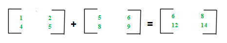
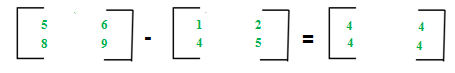
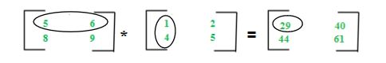

# Matrix Operations (Addition, Subtraction, Multiplication)

## Matrices Addition

The addition of two matrices A m*n and Bm*n gives a matrix Cm\*n. Here, m and n represents the number of rows and columns in the matrix respectively. The elements of C are sum of corresponding elements in A and B which can be shown as:

Example: - mat1 = {{1, 2}, {3, 4}} mat2 = {{1, 2}, {3, 4}} mat1 + mat2 = {{2, 4}, {6, 8}}

The algorithm for addition of matrices can be written as:

    for i in 1 to m
        for j in 1 to n
            cij = aij + bij

Code:

    #include <bits/stdc++.h>
    using namespace std;

    int main(){

    int N = 2, M = 2;
    int m1[N][M] = { { 1, 2 },
                    { 4, 5 } };
    int m2[N][M] = { { 5, 6 },
                    { 8, 9 } };
    int ans[N][M];

    // Traversing number of Rows
    for(int i = 0; i < N; i++)
    {
        // Traversing number of Columns
        for (int j = 0; j < M; j++)
        {
            ans[i][j] = m1[i][j] + m2[i][j];
        }
    }

    for (int i = 0; i < N; i++)
    {
        for (int j = 0; j < M; j++)
        {
            cout<<ans[i][j]<<" ";
        }
        cout<<endl;
    }

    }

Key points:

- Addition of matrices is commutative which means A+B = B+A
- Addition of matrices is associative which means A+(B+C) = (A+B)+C
- The order of matrices A, B and A+B is always same
- If order of A and B is different, A+B can’t be computed
- The complexity of addition operation is O(m*n) where m*n is order of matrices

## Matrices Subtraction

The subtraction of two matrices Am*n and Bm*n gives a matrix Cm\*n. Here, m and n represents the number of rows and columns in the matrix respectively. The elements of C are difference of corresponding elements in A and B which can be represented as:

Example: - mat1 = {{1, 2}, {3, 4}}mat2 = {{1, 2}, {3, 4}}mat1 - mat2 = {{0, 0}, {0, 0}}

The algorithm for subtraction of matrices can be written as:

    for i in 1 to m
        for j in 1 to n
            cij = aij-bij

Code:

    int main(){

    int N = 2, M = 2;
    int m1[N][M] = { { 5, 6 },
                    { 8, 9 } };
    int m2[N][M] = { { 1, 2 },
                    { 4, 5 } };
    int ans[N][M];

    // Traversing number of Rows
    for(int i = 0; i < N; i++)
    {
        // Traversing number of Columns
        for (int j = 0; j < M; j++)
        {
            ans[i][j] = m1[i][j] - m2[i][j];
        }
    }

    for (int i = 0; i < N; i++)
    {
        for (int j = 0; j < M; j++)
        {
            cout<<ans[i][j]<<" ";
        }
        cout<<endl;
    }

    }

Key points:

- Subtraction of matrices is non-commutative which means A-B ≠ B-A
- Subtraction of matrices is non-associative which means A-(B-C) ≠ (A-B)-C
- The order of matrices A, B and A-B is always same
- If order of A and B is different, A-B can’t be computed
- The complexity of subtraction operation is O(m*n) where m*n is order of matrices

## Matrices Multiplication

The multiplication of two matrices Am*n and Bn*p gives a matrix Cm\*p.

It means number of columns in A must be equal to number of rows in B to calculate C=A\*B.

To calculate element C11, multiply elements of 1st row of A with 1st column of B and add them (5*1+6*4) which can be shown as:

Example: - mat1 = {{1, 2}, {3, 4}}mat2 = {{1, 2}, {3, 4}}mat1 \* mat2 = {{7, 10}, {15, 22}}

The algorithm for multiplication of matrices A with order m*n and B with order n*p can be written as:

    for i in 1 to m
        for j in 1 to p
            cij = 0
            for k in 1 to n
                cij += aik*bkj

Code:

    int main(){

    int M = 2, N = 2, P = 2;
    int m1[M][N] = { { 5, 6 },
                    { 8, 9 } };
    int m2[N][P] = { { 1, 2 },
                    { 4, 5 } };
    int ans[M][P];

    // Traversing number of Rows
    for(int i = 0; i < M; i++)
    {
        // Traversing number of Columns
        for (int j = 0; j < P; j++)
        {
            ans[i][j] = 0;

            for( int k = 0; k < N; k++ )
                ans[i][j] += m1[i][k] * m2[k][j];
        }
    }

    for (int i = 0; i < N; i++)
    {
        for (int j = 0; j < M; j++)
        {
            cout<<ans[i][j]<<" ";
        }
        cout<<endl;
    }

    }

Key points:

- Multiplication of matrices is always non-commutative which means A*B ≠ B*A
- Multiplication of matrices is associative which means A*(B*C) = (A*B)*C
- For computing A\*B, the number of columns in A must be equal to number of rows in B
- Existence of A*B does not imply existence of B*A
- The complexity of multiplication operation (A*B) is O(m*n*p) where m*n and n\*p are order of A and B respectively
- The order of matrix C computed as A*B is O(m*p) where m*n and n*p are order of A and B respectively
