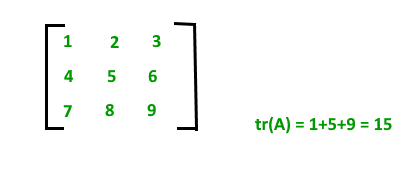

[back](./../readme.md)

# Introduction to Matrix

A matrix represents a collection of numbers arranged in order of rows and columns. It is necessary to enclose the elements of a matrix in parentheses or brackets.

A matrix with 9 elements is shown below:

The above Matrix M has 3 rows and 3 columns. Each element of matrix [M] can be referred to by its row and column number. For example, M23 = 6

Order of a Matrix : The order of a matrix is defined in terms of its number of rows and columns.

Order of a matrix = No. of rows × No. of columns

Therefore, Matrix [M] is a matrix of order 3 × 3.

#### Transpose of a Matrix

The transpose [M]T of an m x n matrix [M] is the n x m matrix obtained by interchanging the rows and columns of [M].

Transpose of a matrix A is defined as:

    if A= [aij] mxn:
    then AT = [bij] nxm where bij = aji

For Example, transpose of matrix M, MT will be:

    M   = 1 2 3
        4 5 6
        7 8 9

    MT  = 1 4 7
        2 5 8
        3 6 9

Properties of transpose of a matrix:

- (AT)T = A
- (A+B)T = AT + BT
- (AB)T = BTAT

Properties of Matrix addition and multiplication:

- A+B = B+A (Commutative)
- (A+B)+C = A+ (B+C) (Associative)
- AB ≠ BA (Not Commutative)
- (AB) C = A (BC) (Associative)
- A (B+C) = AB+AC (Distributive)

Terminologies:

- **Square Matrix**: A square Matrix has as many rows as it has columns. i.e. no of rows = no of columns.
- **Symmetric matrix**: A square matrix is said to be symmetric if the transpose of original matrix is equal to its original matrix. i.e. (AT) = A.
- **Skew-symmetric**: A skew-symmetric (or antisymmetric or antimetric[1]) matrix is a square matrix whose transpose equals its negative.i.e. (AT) = -A.
- **Diagonal Matrix**:A diagonal matrix is a matrix in which the entries outside the main diagonal are all zero. The term usually refers to square matrices.
- **Identity Matrix**:A square matrix in which all the elements of the principal diagonal are ones and all other elements are zeros.Identity matrix is denoted as I.
- **Orthogonal Matrix**: A matrix is said to be orthogonal if AAT = ATA = I.
- **Idemponent Matrix**: A matrix is said to be idemponent if A2 = A.
- **Involutary Matrix**: A matrix is said to be Involutary if A2 = I.
- **Singular Matrix**: A square matrix is said to be singular matrix if its determinant is zero i.e. |A|=0
- **Nonsingular Matrix**: A square matrix is said to be non-singular matrix if its determinant is non-zero.

**Trace of a matrix:** trace of a matrix is denoted as tr(A) which is used only for square matrix and equals the sum of the diagonal elements of the matrix. For example:

