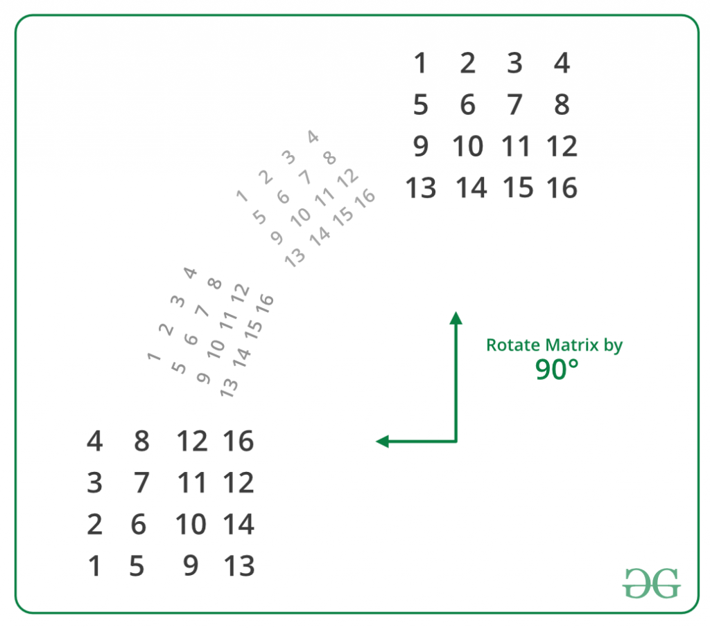
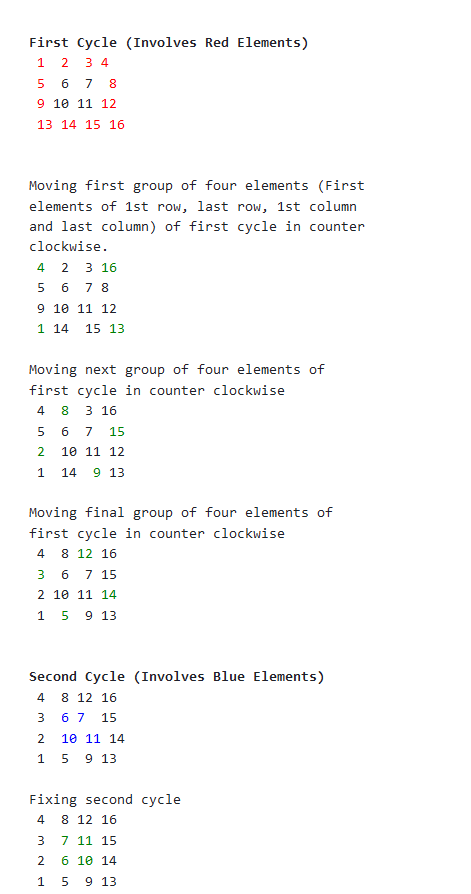

# Matrix Rotation

Given a Square Matrix of dimension N \* N. The task is to rotate the matrix in anti-clock wise direction by 90 degrees.

#### Approach 1

On observing carefully, we can easily conclude that:

    first row of destination ------> last column of source
    second row of destination ------> second last column of source
    .
    .
    .
    .
    last row of destination ------> first column of source

Therefore, rotating a matrix in anti-clockwise direction by 90 degrees is equivalent to replacing rows from top of the matrix by columns from the end.

Implementation of above approach: This method can be easily implemented by using extra space. The idea is to create a temporary matrix of same dimensions as that of the orginal matrix and copy the original matrix into this temporary matrix. Finally, replace each row in the orginal matrix one by one by columns of the temporary matrix from last to first.

Algorithm:

Original Matrix: mat[N][N].
Temporary Matrix: temp[N][N].

Copy original matrix into temporary matrix:

    for(i = 0; i < N; i++)
    {
        for(j = 0; j < N; j++)
        {
            temp[i][j] = mat[i][j];
        }
    }

Updating Original Matrix by Rotated Matrix:

    // Replace each row in the orginal matrix one by
    // one by columns of the temporary matrix from
    // last to first
    for(i = 0; i < N; i++)
    {
        for(j = 0; j < N; j++)
        {
            mat[i][j] = temp[j][N-i-1];
        }
    }

#### Approach 2

Without Using Extra Space

The above problem can also be solved without using any addition matrix or extra-space. This is also called in-place rotating a square matrix by 90 degrees in anti-clockwise direction.

An N x N matrix will have floor(N/2) square cycles. For example, a 4 X 4 matrix will have 2 cycles. The first cycle is formed by its 1st row, last column, last row and 1st column. The second cycle is formed by 2nd row, second-last column, second-last row and 2nd column.

The idea is for each square cycle, we swap the elements involved with the corresponding cell in the matrix in anti-clockwise direction i.e. from top to left, left to bottom, bottom to right and from right to top one at a time. We use nothing but a temporary variable to achieve this.

Code:

    void rotateMatrix(int mat[][N])
    {
        // Consider all squares one by one
        for (int i = 0; i < N / 2; i++)
        {
            // Consider elements in group of 4 in
            // current square
            for (int j = i; j < N-i-1; j++)
            {
                // store current cell in temp variable
                int temp = mat[i][j];

                // move values from right to top
                mat[i][j] = mat[j][N-1-i];

                // move values from bottom to right
                mat[j][N-1-i] = mat[N-1-i][N-1-j];

                // move values from left to bottom
                mat[N-1-i][N-1-j] = mat[N-1-j][i];

                // assign temp to left
                mat[N-1-j][i] = temp;
            }
        }
    }
