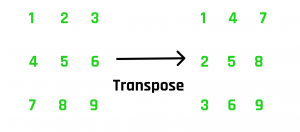

# Transpose of a Matrix

Transpose of a matrix is obtained by changing rows to columns and columns to rows. In other words, transpose of A[ ][ ] is obtained by changing A[ i ][ j ] to A[ j ][ i ].We are given a matrix of size m\*n, We have to print the transpose of the matrix.

We have given matrix A[ m ][ n ], We will create auxiliary matrix B[ n ][ m ] for storing the Transpose of the Matrix A. The idea is to place A [ j ][ i ] at B [ i ][ j ].

    void transpose(A[m][n])
    {
        B[n][m] // Transpose Matrix

        for ( i=0 to n-1 )
        {
            for ( j=0 to m-1 )
                B[i][j] = A[j][i]
        }
    }

Code:

    int main() {
        int rows, cols;
        cout << "Enter the number of rows and columns of the matrix: ";
        cin >> rows >> cols;

        int matrix[rows][cols];
        cout << "Enter the elements of the matrix:" << endl;
        for (int i = 0; i < rows; i++) {
            for (int j = 0; j < cols; j++) {
                cin >> matrix[i][j];
            }
        }

        cout << "The original matrix is:" << endl;
        for (int i = 0; i < rows; i++) {
            for (int j = 0; j < cols; j++) {
                cout << matrix[i][j] << " ";
            }
            cout << endl;
        }

        cout << "The transpose of the matrix is:" << endl;
        for (int i = 0; i < cols; i++) {
            for (int j = 0; j < rows; j++) {
                cout << matrix[j][i] << " ";
            }
            cout << endl;
        }

        return 0;
    }
