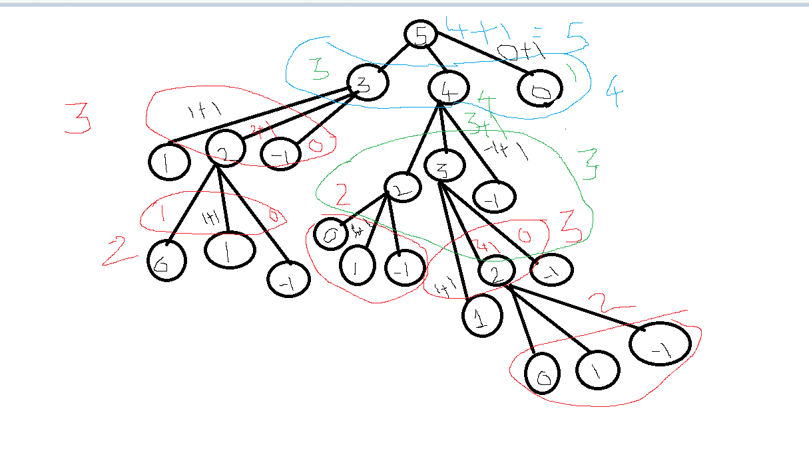

[back](../recursion.md)

# Rope Cutting problem

- Given a rope of length N meters, and the rope can be cut in only 3 sizes A, B and C. The task is to maximizes the number of cuts in rope. If it is impossible to make cut then print the number else print -1

          Input:

          N = 17, A = 10, B = 11, C = 3

          Output: 3

          Explanation: The maximum cut can be obtain after making 2 cut of length 3 and one cut of length 11.

          Input: N = 10, A = 9, B = 7, C = 11

          Output: -1

          Explanation: It is impossible to make any cut so output will be -1.

  Explanation:

  - let n = 5, a = 2, b = 1, c = 5;

  - given rope of length 5, each step we try to subtract a, b, and c from the current length.

  - the final answer would be the max height of the tree

    

    Code:

            int maxCuts(int n, int a, int b, int c)
            {
                if(n == 0)
                    return 0;
                if(n <= -1)
                    return -1;

                int res = max(maxCuts(n-a, a, b, c),
                        max(maxCuts(n-b, a, b, c),
                        maxCuts(n-c, a, b, c)));

                if(res == -1)
                    return -1;

                return res + 1;
            }
