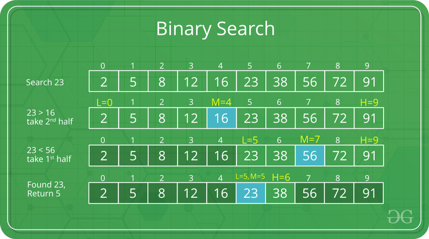

[home](./../readme.md)

# Searching

## Binary Search :

Given a sorted array arr[] of n elements, write a function to search a given element x in arr[] and return the index of x in the array.

Examples:

    Input: arr[] = {10, 20, 30, 50, 60, 80, 110, 130, 140, 170}, x = 110
    Output: 6
    Explanation: Element x is present at index 6.

    Input: arr[] = {10, 20, 30, 40, 60, 110, 120, 130, 170}, x = 175
    Output: -1
    Explanation: Element x is not present in arr[].

Binary Search Approach:

- Binary Search is a searching algorithm used in a sorted array by repeatedly dividing the search interval in half. The idea of binary search is to use the information that the array is sorted and reduce the time complexity to O(Log n).

Binary Search Algorithm: The basic steps to perform Binary Search are:

- Begin with the mid element of the whole array as a search key.
- If the value of the search key is equal to the item then return an index of the search key.
- Or if the value of the search key is less than the item in the middle of the interval, narrow the interval to the lower half.
- Otherwise, narrow it to the upper half.
  Repeatedly check from the second point until the value is found or the interval is empty.

                  high = mid - 1

Code:

    int binarySearch(int arr[], int l, int r, int x)
    {
        if (r >= l) {
            int mid = l + (r - l) / 2;

            // If the element is present at the middle
            // itself
            if (arr[mid] == x)
                return mid;

            // If element is smaller than mid, then
            // it can only be present in left subarray
            if (arr[mid] > x)
                return binarySearch(arr, l, mid - 1, x);

            // Else the element can only be present
            // in right subarray
            return binarySearch(arr, mid + 1, r, x);
        }

        // We reach here when element is not
        // present in array
        return -1;
    }

---

## Binary Search Functions in C++ STL

The C++ standard template library have some built-in functions that can be used to perform Binary Search operation directly on a sequential list or container.

Some of these functions are:

- binary_search() :

  This function only checks if a particular element is present in a sorted container or not. It accepts the starting iterator, ending iterator and the element to be checked as parameters and returns True if the element is present otherwise False.

  Syntax:

        binary_search(start_ptr, end_ptr, ele)

- upper_bound():

  The upper_bound() function is used to find the upper bound of an element present in a container. That is it finds the location of an element just greater than a given element in a container. This function accepts the start iterator, end iterator and the element to be checked as parameters and returns the iterator pointing to the element just greater than the element passed as the parameter. If there does not exist any such element than the function returns an iterator pointing to the last element.

  Syntax:

        upper_bound(first_itr, last_itr, ele)

  Return Value: Returns an iterator pointing to the element just greater than ele.

- lower_bound():

  The lower_bound() function is used to find the lower bound of an element present in a container. That is it finds the location of an element just smaller than a given element in a container. This function accepts the start iterator, end iterator and the element to be checked as parameters and returns the iterator pointing to the lower bound of the element passed as the parameter. If all elements of the container are smaller are less than the element passed, then it returns the last iterator.

  Syntax:

        lower_bound(first_itr, last_itr, ele)

  Return Value: Returns an iterator pointing to the lower bound of the element ele. That is if ele exists in the container, it returns an iterator pointing to ele otherwise it returns an iterator pointing to the element just greater than ele.

### Ternary Search

Ternary Search is a Divide and Conquer Algorithm used to perform search operation in a sorted array. This algorithm is similar to the Binary Search algorithm but rather than dividing the array into two parts, it divides the array into three equal parts.

In this algorithm, the given array is divided into three parts and the key (element to be searched) is compared to find the part in which it lies and that part is further divided into three parts.

We can divide the array into three parts by taking mid1 and mid2 which can be calculated as shown below. Initially, l and r will be equal to 0 and N-1 respectively, where N is the length of the array.

    mid1 = l + (r-l)/3
    mid2 = r – (r-l)/3

Code:

    int ternarySearch(int l, int r, int key, int ar[])
    {
    if (r >= l)
    {
    // Find mid1 and mid2
    int mid1 = l + (r - l) / 3;
    int mid2 = r - (r - l) / 3;

            // Check if key is present at any mid
            if (ar[mid1] == key)
            {
                return mid1;
            }
            if (ar[mid2] == key)
            {
                return mid2;
            }

            // Since key is not present at mid,
            // check in which region it is present
            // then repeat the Search operation
            // in that region
            if (key < ar[mid1])
            {

                // The key lies in between l and mid1
                return ternarySearch(l, mid1 - 1, key, ar);
            }
            else if (key > ar[mid2])
            {

                // The key lies in between mid2 and r
                return ternarySearch(mid2 + 1, r, key, ar);
            }
            else
            {

                // The key lies in between mid1 and mid2
                return ternarySearch(mid1 + 1, mid2 - 1, key, ar);
            }
        }

        // Key not found
        return -1;

    }

[next](./sampleProblemSearch.md)
