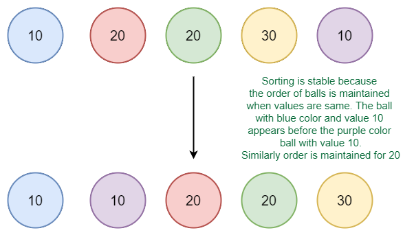

[back](./../readme.md)

# Introduction to Sorting

**Sorting**

Any sequence means to arrange the elements of that sequence according to some specific criterion.

For Example, the array arr[] = {5, 4, 2, 1, 3} after sorting in increasing order will be: arr[] = {1, 2, 3, 4, 5}. The same array after sorting in descending order will be: arr[] = {5, 4, 3, 2, 1}.

**In-Place Sorting**: An in-place sorting algorithm uses constant extra space for producing the output (modifies the given array only). It sorts the list only by modifying the order of the elements within the list.

## Sorting in C++

C++ STL provides a built-in function sort() that sorts a vector or array (items with random access).

Syntax to sort an Array:

    sort(arr, arr+n);

Here, arr is the name or base address of the array
and, n is the size of the array.

Syntax to sort a Vector:

    sort(vec.begin(), vec.end());

Here, vec is the name of the vector.

    int main()
    {
        // Sorting Array
        int arr[] = {1, 5, 8, 9, 6, 7, 3, 4, 2, 0};
        int n = sizeof(arr)/sizeof(arr[0]);

        sort(arr, arr+n);

        cout << "Array after sorting is : \n";
        for (int i = 0; i < n; ++i)
            cout << arr[i] << " ";

        // Sorting Vector
        vector<int> vec = {1,2,4,5,3};

        sort(vec.begin(), vec.end());

        cout << "\nVector after sorting is : \n";
        for (int i = 0; i < vec.size(); ++i)
            cout << vec[i] << " ";

        return 0;
    }

So by default, sort() function sorts an array in ascending order.

How to sort in descending order?

The sort() function takes a third parameter that is used to specify the order in which elements are to be sorted. We can pass "greater<type> ()" function to sort in descending order. This function does comparison in a way that puts greater element before.

    int main()
    {
        int arr[] = {1, 5, 8, 9, 6, 7, 3, 4, 2, 0};
        int n = sizeof(arr)/sizeof(arr[0]);

        sort(arr, arr+n, greater<int>());

        cout << "Array after sorting : \n";
        for (int i = 0; i < n; ++i)
            cout << arr[i] << " ";

        return 0;
    }

How to sort in particular order?

We can also write our own comparator function and pass it as a third parameter.

    struct Interval
    {
        int start, end;
    };

    // Compares two intervals according to staring times.
    bool compareInterval(Interval i1, Interval i2)
    {
        return (i1.start < i2.start);
    }

    int main()
    {
        Interval arr[] =  { {6,8}, {1,9}, {2,4}, {4,7} };
        int n = sizeof(arr)/sizeof(arr[0]);

        // sort the intervals in increasing order of
        // start time
        sort(arr, arr+n, compareInterval);

        cout << "Intervals sorted by start time : \n";
        for (int i=0; i<n; i++)
        cout << "[" << arr[i].start << "," << arr[i].end
                << "] ";

        return 0;
    }

## Stability in Sorting Algorithm

A sorting algorithm is said to be stable if two objects with equal keys appear in the same order in sorted output as they appear in the input data set

Formally stability may be defined as, how the algorithm treats equal elements. Let A[] be an array, and let '<' be a strict weak ordering on the elements of A[]. A sorting algorithm is stable if: where is the sorting permutation ( sorting moves to position) .

Informally, stability means that equivalent elements retain their relative positions, after sorting.

