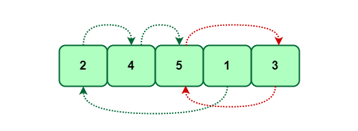

# Cycle Sort

Cycle sort is an in-place sorting Algorithm, unstable sorting algorithm, and a comparison sort that is theoretically optimal in terms of the total number of writes to the original array.

- It is optimal in terms of the number of memory writes. It minimizes the number of memory writes to sort (Each value is either written zero times if it’s already in its correct position or written one time to its correct position.)
- It is based on the idea that the array to be sorted can be divided into cycles. Cycles can be visualized as a graph. We have n nodes and an edge directed from node i to node j if the element at i-th index must be present at j-th index in the sorted array.

Cycle in arr[] = {2, 4, 5, 1, 3}

Cycle in arr[] = {4, 3, 2, 1}

Code:

    void cycleSort (int arr[], int n)
    {
        // count number of memory writes
        int writes = 0;

        // traverse array elements and put it to on
        // the right place
        for (int cycle_start=0; cycle_start<=n-2; cycle_start++)
        {
            // initialize item as starting point
            int item = arr[cycle_start];

            // Find position where we put the item. We basically
            // count all smaller elements on right side of item.
            int pos = cycle_start;
            for (int i = cycle_start+1; i<n; i++)
                if (arr[i] < item)
                    pos++;

            // If item is already in correct position
            if (pos == cycle_start)
                continue;

            // ignore all duplicate  elements
            while (item == arr[pos])
                pos += 1;

            // put the item to it\'s right position
            if (pos != cycle_start)
            {
                swap(item, arr[pos]);
                writes++;
            }

            // Rotate rest of the cycle
            while (pos != cycle_start)
            {
                pos = cycle_start;

                // Find position where we put the element
                for (int i = cycle_start+1; i<n; i++)
                    if (arr[i] < item)
                        pos += 1;

                // ignore all duplicate  elements
                while (item == arr[pos])
                    pos += 1;

                // put the item to it\'s right position
                if (item != arr[pos])
                {
                    swap(item, arr[pos]);
                    writes++;
                }
            }
        }

        // Number of memory writes or swaps
        // cout << writes << endl ;
    }
