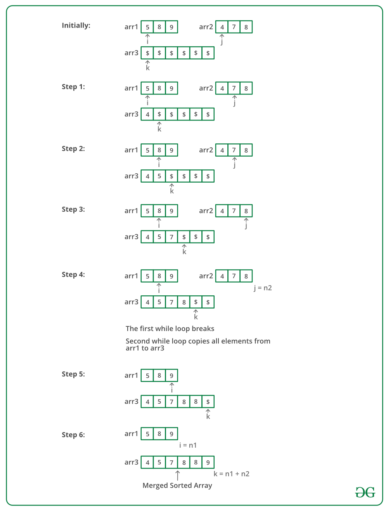

# Merge two Sorted Arrays

Given two sorted arrays, the task is to merge them in a sorted manner.
Examples:

    Input: arr1[] = { 1, 3, 4, 5}, arr2[] = {2, 4, 6, 8}
    Output: arr3[] = {1, 2, 3, 4, 4, 5, 6, 8}

    Input: arr1[] = { 5, 8, 9}, arr2[] = {4, 7, 8}
    Output: arr3[] = {4, 5, 7, 8, 8, 9}

The idea is to use Merge function of Merge sort.

1. Create an array arr3[] of size n1 + n2.
1. Simultaneously traverse arr1[] and arr2[].
   1. Pick smaller of current elements in arr1[] and arr2[], copy this smaller element to next position in arr3[] and move ahead in arr3[] and the array whose element is picked.
1. If there are remaining elements in arr1[] or arr2[], copy them also in arr3[].

Below image is a dry run of the above approach:

    void mergeArrays(int arr1[], int arr2[], int n1, int n2, int arr3[]) {
        int i = 0, j = 0, k = 0;

        while (i < n1 && j < n2) {
            if (arr1[i] < arr2[j])
                arr3[k++] = arr1[i++];
            else
                arr3[k++] = arr2[j++];
        }

        while (i < n1)
            arr3[k++] = arr1[i++];

        while (j < n2)
            arr3[k++] = arr2[j++];
    }
