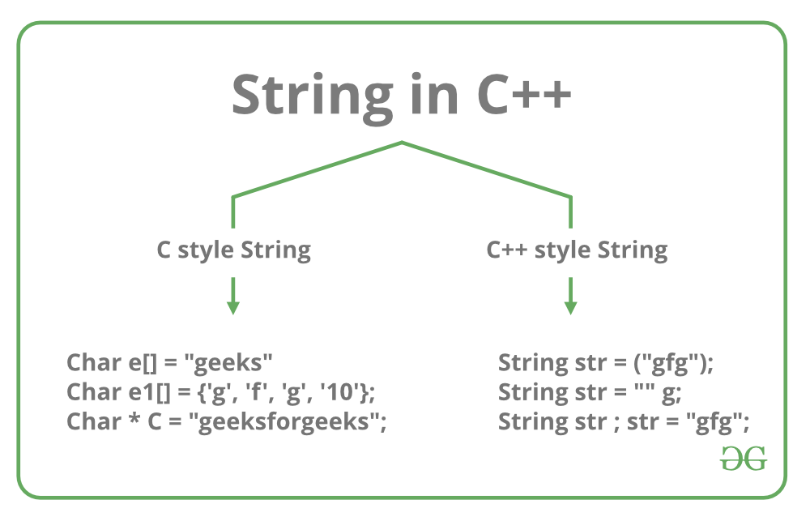

[back](./../readme.md)

# Introduction to Strings

Strings are defined as a stream of characters. Strings are used to represent text and are generally represented by enclosing text within quotes as: "This is a sample string!".

### Strings in C/C++

In C/C++, Strings are defined as an array of characters. The difference between a character array and a string is that the string is terminated with a special character ‘\0’.

Declaring Strings: Declaring a string is as simple as declaring a one-dimensional array. Below is the basic syntax for declaring a string.

char str_name[size];

In the above syntax, str_name is any name given to the string variable and size is used to define the length of the string, i.e the number of characters strings will store. Please keep in mind that there is an extra terminating character which is the Null character ('\0') used to indicate the termination of string which differs strings from normal character arrays.

Initializing a String: A string can be initialized in different ways. We will explain this with the help of an example. Below is an example to declare a string with the name as str and initialize it with “GeeksforGeeks”.

    1. char str[] = "GeeksforGeeks";

    2. char str[50] = "GeeksforGeeks";

    3. char str[] = {'G','e','e','k','s','f','o','r','G','e','e','k','s','\0'};

    4. char str[14] = {'G','e','e','k','s','f','o','r','G','e','e','k','s','\0'};

### std::string Class in C++

C++ has in its definition a way to represent the sequence of characters as an object of a class. This class is called std::string. The String class stores the characters as a sequence of bytes with functionality of allowing access to single byte character.

string Class vs Character array:

- A character array is simply an array of characters can terminated by a null character. A string is a class which defines objects that be represented as stream of characters.
- Size of the character array has to allocated statically, more memory cannot be allocated at run time if required. Unused allocated memory is wasted in case of character array. In case of strings, memory is allocated dynamically. More memory can be allocated at run time on demand. As no memory is preallocated, no memory is wasted.
- Implementation of character array is faster than std:: string. Strings are slower when compared to implementation than character array.
- Character array does not offer much inbuilt functions to manipulate strings. String class defines a number of functionalities which allow manifold operations on strings.

Declaration Syntax: Declaring string using string class is simple and can be done using the string keyword as shown below.

string string_name = "Sample String";

